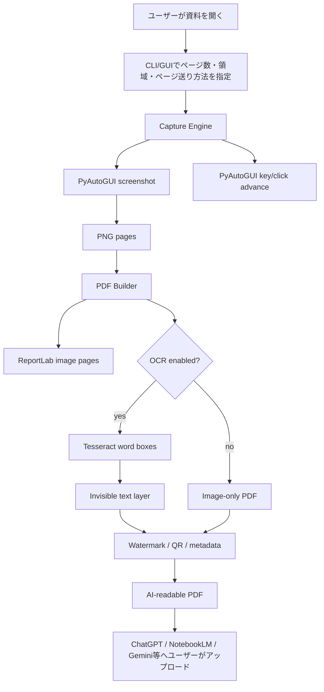

# AI Readable PDF Capture

許可された資料・自分で権利を持つ資料を、ページ送り付きで自動キャプチャし、AIサービスに読み込ませやすい **透明テキスト付きPDF** に変換するOSSスタイルのPythonアプリです。

このリポジトリは、ソースネクストの「0秒読書」の目的である「電子書籍や資料をキャプチャして、AIで活用しやすいPDFを作る」というユースケースを、既存OSSの考え方を組み合わせて再現したものです。DRM解除、コピー防止回避、規約違反になるキャプチャ、第三者配布を支援する機能は含めていません。

## 何ができるか

- ページ送りキーまたはクリックで進む資料を、指定ページ数だけ自動スクリーンショット
- 全画面または指定矩形 `x,y,width,height` のみをキャプチャ
- PNG画像を1つのPDFに結合
- Tesseract OCRが入っている環境では、透明テキストレイヤー付きPDFを生成
- PDF全ページへ所有者ラベルとQRコードを埋め込み
- CI上ではデモ画像からPDFを生成し、Artifactとして取得可能
- Windows / macOS / Linuxで動くCLI、任意でTkinter簡易GUI

## 既存OSS調査と採用方針

| 目的 | 参考OSS / ライブラリ | このリポジトリでの使い方 |
|---|---|---|
| 画面・キーボード・マウス自動操作 | PyAutoGUI | スクリーンショット取得、ページ送りキー、クリック送信 |
| 画像からPDF作成 | ReportLab / Pillow | 画像をページ全面に配置してPDF化 |
| OCRで検索可能PDF化 | Tesseract / pytesseract / OCRmyPDFの思想 | Tesseractの単語座標をPDF上の透明テキストとして重ねる |
| 共有抑止・追跡ラベル | qrcode / pypdf | 所有者ラベル、QR、PDFメタデータを追加 |

既存OSSを丸ごと複製するのではなく、目的を満たす最小構成として再実装しています。

## 重要な利用条件

このツールは **自分で権利を持つ資料、社内で利用許可された資料、パブリックドメイン、Creative Commons、規約上キャプチャが許可された資料** だけに使ってください。

以下には使わないでください。

- DRMやコピー防止を回避する目的
- サービス利用規約でキャプチャが禁止されているコンテンツ
- 作成したPDFの第三者配布、販売、無断共有
- 著作権侵害や情報漏えいにつながる用途

## すぐ試す

Python 3.11以上を推奨します。

```bash
python -m pip install -e .
ai-pdf-capture demo --output-dir outputs/demo
```

生成物:

```text
outputs/demo/demo.pdf
outputs/demo/pages/page_0001.png
outputs/demo/pages/page_0002.png
outputs/demo/pages/page_0003.png
```

## 実際に画面をキャプチャする

例: 右矢印でページ送りできる資料を、20ページ分キャプチャしてPDF化します。

```bash
ai-pdf-capture run \
  --pages 20 \
  --advance key:right \
  --delay 0.6 \
  --region 120,80,1200,1600 \
  --owner-label "owner: your-name / private-use-only" \
  --output outputs/book.pdf \
  --acknowledge-compliance
```

全画面キャプチャの場合は `--region` を省略します。

```bash
ai-pdf-capture run --pages 5 --advance key:pagedown --output outputs/capture.pdf --acknowledge-compliance
```

クリックでページ送りする場合:

```bash
ai-pdf-capture run --pages 10 --advance click:1800,980 --delay 0.5 --output outputs/click.pdf --acknowledge-compliance
```

## Kindleで使う

Kindleアプリで使う場合は、まず [docs/kindle.md](docs/kindle.md) を確認してください。通常の購入済みKindle本を丸ごとPDF化する用途ではなく、自作原稿、許可済み資料、Public Domain、社内利用許可済みドキュメントなどに限定してください。

最小テスト:

```bash
ai-pdf-capture run \
  --pages 2 \
  --advance key:right \
  --delay 0.8 \
  --output outputs/kindle-test.pdf \
  --owner-label "private-use-only" \
  --acknowledge-compliance
```

キーで進まない場合は、Kindle画面右側のページ送り矢印をクリック座標で指定します。

```bash
ai-pdf-capture run \
  --pages 2 \
  --advance click:1800,980 \
  --delay 0.8 \
  --output outputs/kindle-test.pdf \
  --owner-label "private-use-only" \
  --acknowledge-compliance
```

## OCR付きPDFを作る

Tesseractをインストール済みなら、`--ocr` を付けます。

```bash
ai-pdf-capture build outputs/demo/pages --output outputs/searchable.pdf --ocr --language eng+jpn
```

Windowsでは Tesseract OCR と日本語データ `jpn.traineddata` が必要です。詳細は [docs/setup.md](docs/setup.md) を参照してください。

## 簡易GUI

```bash
ai-pdf-capture gui
```

GUIはCLIの薄いラッパーです。安定運用や自動化にはCLIを推奨します。

## GitHub Actionsで成果物を取得する

Actionsの `CI` workflow は以下を自動実行します。

1. Pythonセットアップ
2. 依存関係インストール
3. Ruff lint
4. pytest
5. デモPDF生成
6. `ai-readable-pdf-demo` artifact アップロード

手動実行も可能です。

```text
Actions → CI → Run workflow
```

## アーキテクチャ



### GPT Image 最新モデルで説明画像を作るためのプロンプト

READMEや社内手順書に載せる説明画像をGPT Imageの最新モデルで作る場合は、以下のプロンプトを使ってください。

```text
日本語の横長インフォグラフィックを作成してください。テーマは「AI Readable PDF Capture のアーキテクチャと処理フロー」。左から右へ、1 ユーザーが許可された資料を開く、2 CLI または GUI でページ数・キャプチャ領域・ページ送り方法を指定、3 PyAutoGUI がスクリーンショット取得とページ送り、4 PNG画像を保存、5 Tesseract OCRで単語座標を取得、6 ReportLabで画像PDFと透明テキストレイヤーを生成、7 所有者ラベルとQRコードを埋め込み、8 ChatGPT NotebookLM GeminiなどにユーザーがPDFをアップロード、という流れを、初心者にもわかるアイコン付きで表現。DRM回避禁止、規約遵守、第三者配布禁止の注意書きを下部に小さく入れる。白背景、青と緑の配色、シンプルで業務向け。
```

## 本番運用に必要なもの

- Python 3.11+
- キャプチャ対象の閲覧アプリ、PDFビューア、Webブラウザなど
- ページ送りができるキーまたはクリック位置
- OCRを使う場合は Tesseract OCR と対象言語データ
- 社内利用なら、利用規約・著作権・機密情報ルールの確認
- 自動実行する場合は、専用PCまたは仮想デスクトップ環境

## 主要コマンド

```bash
ai-pdf-capture demo --output-dir outputs/demo
ai-pdf-capture capture --pages 10 --advance key:right --output-dir outputs/pages --acknowledge-compliance
ai-pdf-capture build outputs/pages --output outputs/result.pdf --ocr --owner-label "private"
ai-pdf-capture run --pages 10 --advance key:right --output outputs/result.pdf --acknowledge-compliance
```

## 開発

```bash
python -m pip install -e ".[dev]"
pytest -q
ruff check .
```

## ドキュメント

- [docs/architecture.md](docs/architecture.md) — 詳細アーキテクチャ
- [docs/setup.md](docs/setup.md) — Windows/macOS/Linux初期設定
- [docs/kindle.md](docs/kindle.md) — Kindleアプリでの使い方
- [docs/oss-research.md](docs/oss-research.md) — OSS調査メモ
- [CODEX.md](CODEX.md) — AI開発エージェント向けの実装ルール

## ライセンス

MIT License
