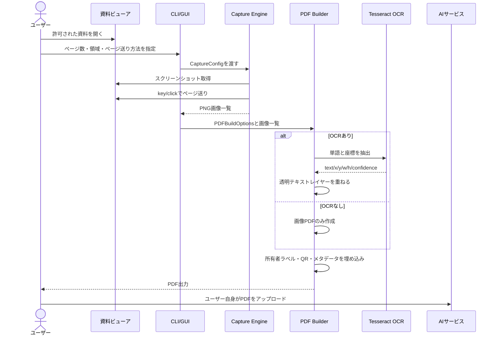
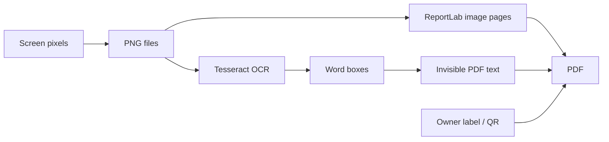

# Architecture

AI Readable PDF Capture は、許可された資料を画面キャプチャし、AIに読み込ませやすいPDFへ変換するためのローカル実行型アプリです。

## コンポーネント

| コンポーネント | 役割 | 主なファイル |
|---|---|---|
| CLI | ユーザー入力、ワークフロー起動 | `src/ai_readable_pdf_capture/cli.py` |
| GUI | Tkinterによる簡易操作画面 | `src/ai_readable_pdf_capture/gui.py` |
| Capture Engine | スクリーンショット取得、ページ送り | `src/ai_readable_pdf_capture/capture.py` |
| PDF Builder | 画像PDF化、OCRテキストレイヤー、QR、メタデータ | `src/ai_readable_pdf_capture/pdf_builder.py` |
| Config Loader | YAML設定読み込み | `src/ai_readable_pdf_capture/config.py` |
| Demo Generator | CI/検証用のサンプルPDF生成 | `src/ai_readable_pdf_capture/demo.py` |

## 処理フロー

## 設計上の境界線

- DRM解除やコピー防止回避は実装しない
- キャプチャ可否はユーザーの権利・契約・規約に依存するため、実行時に明示的な `--acknowledge-compliance` を要求する
- OCRはローカルTesseractを使うため、文書内容を外部APIへ送信しない
- 生成PDFには所有者ラベルやQRを埋め込めるが、これは共有抑止の補助であり、法的・技術的な完全保護ではない

## データフロー

## CI/CD

GitHub Actions `CI` は次を実行します。

- `ruff check .`
- `pytest`
- `ai-pdf-capture demo --output-dir outputs/demo`
- `outputs/demo` をArtifactとしてアップロード

実画面キャプチャはGUIセッションが必要なためCIでは行いません。CIではドライラン画像からPDF生成までを検証します。

## 今後の拡張案

- 矩形選択UI
- 重複ページ検出による自動停止
- PDF分割出力
- OCRmyPDF連携モード
- Playwright/Seleniumによる許可されたWeb資料のブラウザ自動キャプチャ
- 社内監査ログ出力
