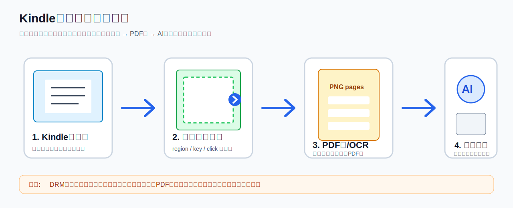
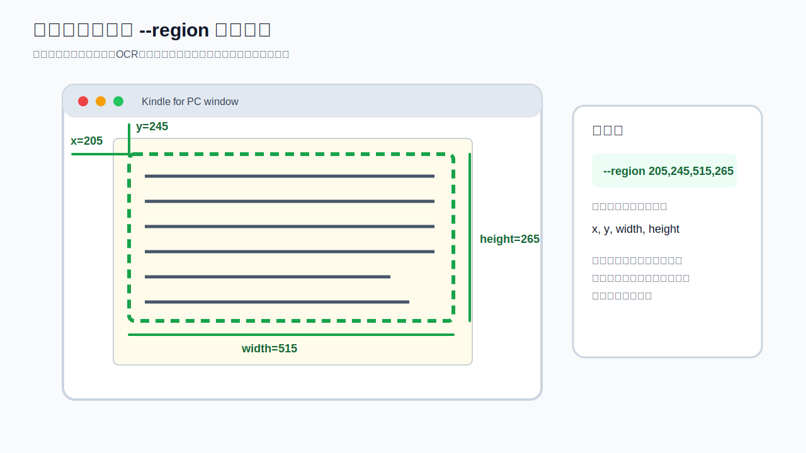
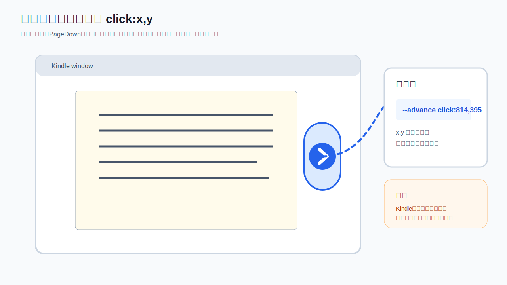
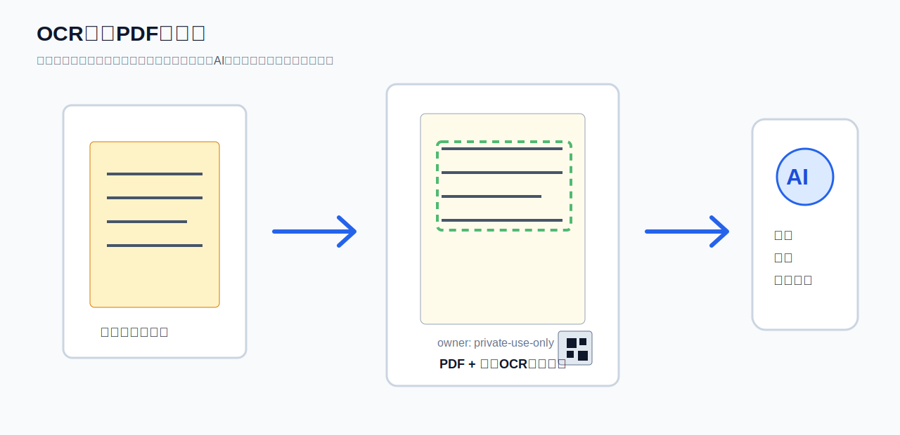

# Kindle Usage Guide

このガイドは、AI Readable PDF Capture を Kindle アプリの画面に対して使う場合の手順です。

## 重要な前提

このツールは、DRM解除・コピー防止回避・購入済みKindle本の無断複製を目的にしたものではありません。

使ってよい例:

- 自分で作成した原稿をKindleアプリで確認している場合
- 社内・学校・チームでキャプチャとOCR化が許可された資料
- Public Domain / Creative Commons / 著作権者から許可を得た資料
- Kindleへ送信した自作PDFや自作ドキュメント

避けるべき例:

- 通常の購入済みKindle本を丸ごとPDF化する
- DRMやコピー制限を回避する
- 作成したPDFを第三者へ共有・配布・販売する
- Kindle / Amazon / 出版社の利用規約に反する使い方

## 図で見る全体像



**画像の説明:** 左から右へ、Kindleアプリで許可済み資料を開き、CLIでキャプチャ範囲とページ送り方法を指定し、PNG画像をPDF化/OCR化し、最後にユーザー自身がAIサービスへアップロードする流れを示しています。下部の注意書きは、DRM回避・コピー制限回避・購入済み本の無断PDF化・第三者配布をしないためのものです。

## Windows Kindle for PC での基本手順

### 1. Kindleアプリを開く

対象資料をKindle for PCで開きます。読みやすい倍率・横幅に調整します。

**画面で見るポイント:** Kindleウィンドウの本文部分が中央に大きく表示されている状態にします。メニュー、検索欄、余白が多いとPDFにも写るため、できるだけ本文が大きくなるように調整してください。

### 2. ページ送りキーを確認する

Kindle for PCでは、次ページは通常 `PageDown` または `Right Arrow`、前ページは `PageUp` または `Left Arrow` です。環境によって効かない場合は、画面右側に出るページ送り矢印をクリックする方法に切り替えます。

### 3. キャプチャ範囲を決める

最初は全画面でテストしてください。

```bash
ai-pdf-capture run \
  --pages 2 \
  --advance key:right \
  --delay 0.8 \
  --output outputs/kindle-test.pdf \
  --owner-label "private-use-only" \
  --acknowledge-compliance
```

成功したら、余白やメニューを除くために `--region` を使います。



**画像の説明:** 緑の点線で囲まれた部分が、実際にPDFへ入れたい本文領域です。`--region` は `x,y,width,height` の順番で指定します。図の例では、左上の開始位置が `x=205, y=245`、横幅が `width=515`、高さが `height=265` なので、コマンドでは `--region 205,245,515,265` と書きます。実際の数値は自分の画面サイズ・Kindleウィンドウ位置に合わせて変えてください。

```bash
ai-pdf-capture run \
  --pages 20 \
  --advance key:right \
  --delay 0.8 \
  --region 120,80,1200,1600 \
  --output outputs/kindle.pdf \
  --owner-label "private-use-only" \
  --acknowledge-compliance
```

`--region` は `x,y,width,height` です。

### 4. キーでページが進まない場合

クリック座標でページ送りします。Kindle画面右側のページ送り矢印が出る位置を指定します。



**画像の説明:** 青い丸が、ページ送りボタンとしてクリックする位置です。`--advance click:814,395` のように、画面上のクリック位置を `x,y` で指定します。右矢印キーやPageDownでページが進まないときは、この方法に切り替えてください。座標は環境ごとに違うため、図の数値は考え方の例です。

```bash
ai-pdf-capture run \
  --pages 20 \
  --advance click:1800,980 \
  --delay 0.8 \
  --output outputs/kindle-click.pdf \
  --owner-label "private-use-only" \
  --acknowledge-compliance
```

### 5. OCR付きPDFにする

Tesseract OCRを入れている場合だけ `--ocr` を付けます。



**画像の説明:** 左のキャプチャ画像を、中央のPDFへ変換します。PDFの見た目は画像のままですが、緑の点線で示したように裏側へ透明なOCRテキストを重ねます。これにより、AIサービスにアップロードしたときに、単なる画像PDFよりも文字内容を読み取りやすくなります。下部には所有者ラベル、右下にはQRコードを入れられます。

```bash
ai-pdf-capture run \
  --pages 20 \
  --advance key:right \
  --delay 0.8 \
  --output outputs/kindle-searchable.pdf \
  --owner-label "private-use-only" \
  --ocr \
  --language eng+jpn \
  --acknowledge-compliance
```

## 失敗しやすいポイント

### 同じページばかりキャプチャされる

ページ送りキーが効いていません。`--advance key:pagedown` または `--advance click:x,y` に変えてください。

### ページ途中でキャプチャされる

`--delay` を増やします。

```bash
--delay 1.2
```

### 余白やメニューが入る

`--region` で本文部分だけを切り取ります。図の「キャプチャ範囲 --region の考え方」を参考に、本文を囲む矩形だけを指定してください。

### OCRの日本語精度が低い

- Kindle側のフォントサイズを少し大きくする
- 1ページあたりの文字量を減らす
- `tesseract-ocr-jpn` など日本語言語データを入れる
- 画像の倍率を上げる

## 推奨する安全な使い方

まず2ページだけテストし、ページ送り・領域・OCRの品質を確認してから本番ページ数に増やしてください。

```bash
ai-pdf-capture run \
  --pages 2 \
  --advance key:right \
  --delay 1.0 \
  --output outputs/kindle-test.pdf \
  --owner-label "private-use-only" \
  --acknowledge-compliance
```

問題なければページ数を増やします。
